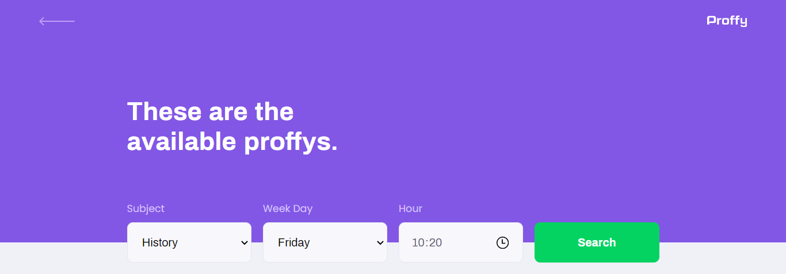
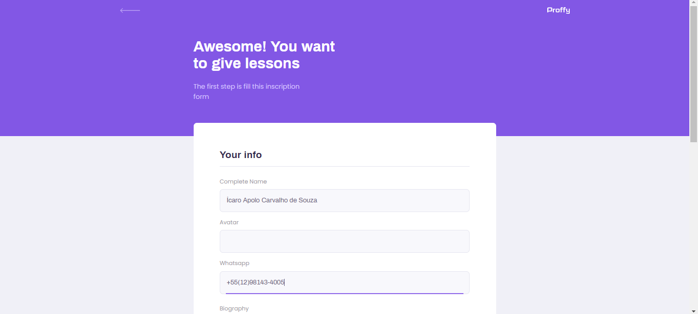
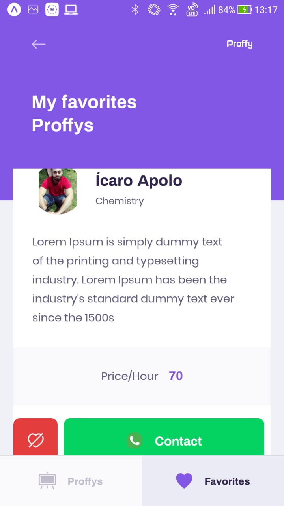

<h2 align="center">
    <br>Next Level Week #2 by Rocketseat <br/>
</h2>

<p align="center">
  
  
  <br/>
</p>

### Web Screenshot
<div>
   
   
   
</div>

### Mobile Screenshot
<div>
   
   
   
</div>

## :rocket: Technologies

-  [Typescript](https://www.typescriptlang.org/)
-  [Node.js](https://nodejs.org/en/)
-  [ReactJS](https://reactjs.org/)
-  [React Native](http://facebook.github.io/react-native/)
-  [Expo](https://expo.io/)
-  [Express](https://expressjs.com/)
-  [Axios](https://github.com/axios/axios)

# :construction_worker: How To Run
- ### **Pre-requisites**

  - It is **necessary** to have **[Node.js](https://nodejs.org/en/)** installed.
  - It is **necessary** to have **[Git](https://git-scm.com/)** installed and configured.
  - It is **necessary** to have a package manager **[Yarn](https://yarnpkg.com/)**.
  - Finally, it is **essential** to have **[Expo](https://expo.io/)** installed globally on the machine.
  
```bash
# Clone Repository
$ git clone https://github.com/IcaroApoloBR/Proffy.git
```
### 📦 Run API

```bash
# Go to server folder
$ cd proffy/server

# Install Dependencies
$ yarn install
# Setting up the database and creating the tables.
$ yarn knex:migrate

# Run Aplication
$ yarn start
```
Access API at http://localhost:3333/

### 💻 Run Web Project

```bash
# Go to web folder
$ cd proffy/web

# Install Dependencies
$ yarn install

# Run Aplication
$ yarn start
```
Go to http://localhost:3000/ to see the result.

### 📱 Run Mobile Project
To run the mobile project you need a cellphone with the app of [expo](https://play.google.com/store/apps/details?id=host.exp.exponent) instaled or a emulator android/ios.
<br />
After, fork this repository and clone to your machine. Inside of the project's folder run the following commands:

```bash
# Go to mobile folder
$ cd proffy/mobile

# Install Dependencies
$ yarn install

# Run Aplication
$ yarn start
```
After read the QRCode with the app of [expo](https://play.google.com/store/apps/details?id=host.exp.exponent) or run on emulator.

## :memo: License
This project is under the MIT license. See the archive [LICENSE](LICENSE.md) for more details.
